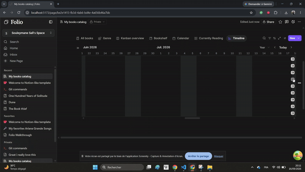

# Folio

A Notion-style collaborative workspace — block editor, nested pages, and inline databases, with real-time collaboration built in.


<!-- gif goes here -->

## Why I'm building this

I wanted a tool where collaboration and notes actually stick around instead of getting lost in a chat scrollback somewhere. Rather than reinvent things Notion's already figured out — the editor, the database views, the page tree — I'm using those as a base and putting the effort into what's missing on top of that.

## Features

- Block editor built on Tiptap/ProseMirror: rich text, callouts, page links, and more
- Notion-style sidebar with nested pages, recents, and trash
- Inline databases with six view types: table, board, gallery, list, calendar, timeline
  - Filtering, sorting, grouping (multi-chip, simple and advanced modes)
  - Column freezing, hiding, reordering
  - Drag-and-drop everywhere — board columns, gallery cards, dragging events to reschedule on the calendar, dragging/resizing event bars on the timeline
  - Calendar and timeline both handle multi-day date ranges, rendered as resizable spanning bars
  - Calendar packs overlapping events into separate tracks so nothing visually collides
- Real-time collaborative editing (Yjs + Hocuspocus)
- Custom media nodes: image (resize handles, floating toolbar, captions, Upload/URL/Unsplash tabs), file previews (PDF, image, code, markdown, text), YouTube embeds, web bookmarks with OG metadata
- Comment threads on pages
- Workspace admin: members, guests, groups, teamspaces
- Light/dark theme, no flash of the wrong one on load

## Stack

| Layer | Technology |
|---|---|
| Editor | Tiptap, ProseMirror |
| Frontend | React, TypeScript |
| Styling | SCSS, CSS custom properties, `color-mix` |
| Data fetching | React Query |
| Backend | Supabase (Postgres + Auth + RLS), PostgREST |
| Real-time collaboration | Yjs, Hocuspocus |
| Local/dev backend | Express, Multer, `marked`, PDF.js |
| Build tooling | Vite |
| Deployment | Vercel |

## A few architecture notes

- **Database records live outside the ProseMirror document.** They're pages with a `sourceId` and a `values` map, resolved through a data source registry instead of stored inline — that's what lets the same record show up consistently across every view type.
- **Cross-NodeView data bridge.** Cell and record NodeViews are each their own ProseMirror node view (separate React roots), so they can't share context directly. Instead, the database's top-level view publishes computed layout into editor storage, and every NodeView subscribes to it via `useSyncExternalStore`.
- **Persistent editor instance.** `EditorProvider` sits above the router so the editor never remounts on navigation. Loading states are overlay skeletons on top of the live editor, never a swap that would unmount it.
- **RLS-driven access control.** Page visibility is enforced at the database layer (`can_access_page`); comment visibility derives from page visibility.

## Getting started

```bash
npm install
npm run dev
```

This starts the Vite dev server and the local Express backend, which serves:

| Service | Port |
|---|---|
| Uploads | 3000 |
| Pages | 3001 |
| Threads | 3002 |
| Versions | 3003 |

For real-time collaboration, also run the Hocuspocus server in a separate terminal:

```bash
cd hocuspocus-server
npx tsx index.ts
```

## Where things stand

The inline database system covers all six view types now and I'm mostly in a polish phase — drag-and-drop consistency across views, resize behavior, overlap handling, and performance work (re-render passes, cold-start time, query fixes).

## Contributing

Mainly me ([Jule](https://github.com/Jule-25))
